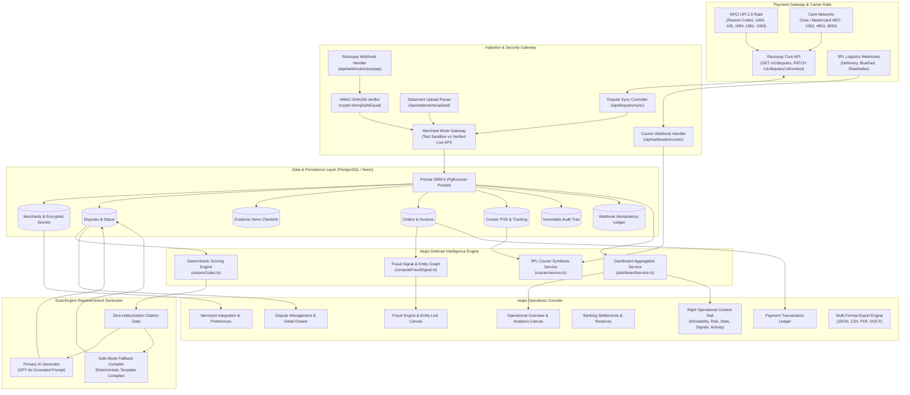
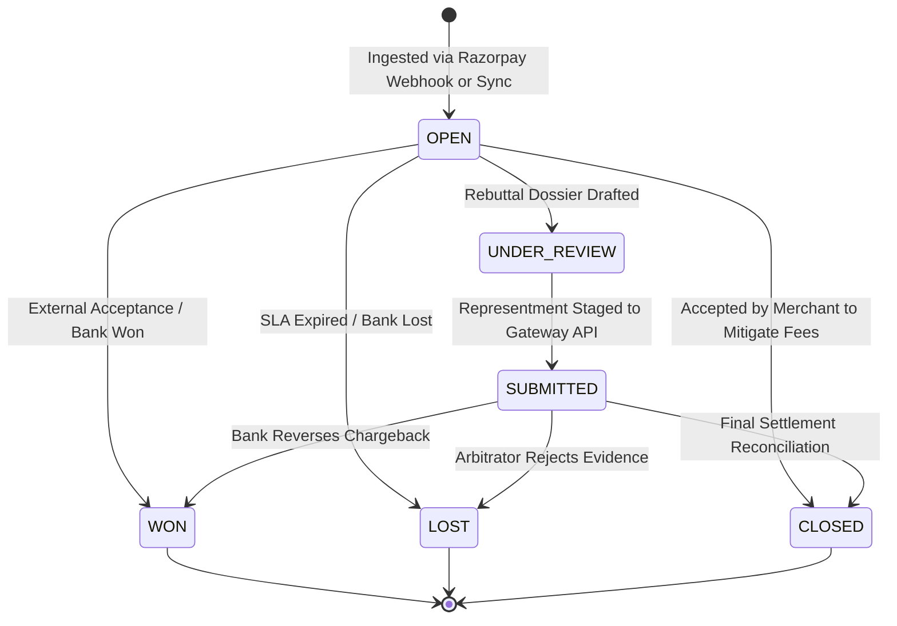

# Razorpay Aegis — Autonomous Chargeback & Dispute Defense Console

<p align="center">
  <a href="https://razorpay.com" target="_blank" rel="noopener noreferrer">
    
  </a>
</p>

<p align="center">
  <strong>Production-oriented dispute operations and defense console for merchants on Indian payment rails, featuring deterministic winnability scoring, first-party fraud intelligence, multi-carrier evidence orchestration, automated rebuttal drafting, custom statement ingestion, multi-format exports, and real-time Razorpay API synchronization.</strong>
</p>

<p align="center">
  <a href="https://aegisrazorpaycom.vercel.app">Production Deployment</a> &bull;
  <a href="https://razorpay.com/docs/payments/disputes/">Razorpay Dispute Docs</a> &bull;
  <a href="https://npci.org.in">NPCI UPI Guidelines</a> &bull;
  <a href="#system-architecture">Architecture</a> &bull;
  <a href="#api-reference">API Reference</a> &bull;
  <a href="#testing--verification">Test Verification</a>
</p>

---

## Notice

> **Hackathon Prototype Notice:** Aegis is an independent technical prototype developed for the Razorpay Hackathon. It is engineered to interface directly with Razorpay Dispute APIs, test-mode acquiring sandboxes, and connected merchant production accounts.

---

## Table of Contents

1. [Executive Summary & Problem Statement](#executive-summary--problem-statement)
2. [Ideation & Core Insights](#ideation--core-insights)
3. [Core Capabilities](#core-capabilities)
4. [System Architecture](#system-architecture)
5. [Dispute Lifecycle & State Machine](#dispute-lifecycle--state-machine)
6. [Aegis Engines](#aegis-engines)
   - [Deterministic Winnability Scoring Engine](#deterministic-winnability-scoring-engine)
   - [First-Party Fraud Intelligence & Entity Graph](#first-party-fraud-intelligence--entity-graph)
   - [Evidence Engine & 3PL Courier Integration](#evidence-engine--3pl-courier-integration)
   - [Dual-Engine Rebuttal Generation & Safe-Mode Fallback](#dual-engine-rebuttal-generation--safe-mode-fallback)
   - [Platform-Wide Immutable Audit Ledger](#platform-wide-immutable-audit-ledger)
7. [Demo / Test vs Live Merchant Modes](#demo--test-vs-live-merchant-modes)
8. [Dashboard & Operational Analytics](#dashboard--operational-analytics)
   - [Right Contextual Sidebar Hierarchy](#right-contextual-sidebar-hierarchy)
9. [Evidence & Statement Ingestion](#evidence--statement-ingestion)
10. [Export System](#export-system)
11. [Supported Network Reason Codes](#supported-network-reason-codes)
12. [API Reference](#api-reference)
13. [Security & Cryptography](#security--cryptography)
14. [Design System, Themes & UX](#design-system-themes--ux)
15. [Progressive Web App (PWA) & Chromium Support](#progressive-web-app-pwa--chromium-support)
16. [Technology Stack](#technology-stack)
17. [Project Structure](#project-structure)
18. [Getting Started](#getting-started)
19. [Environment Variables](#environment-variables)
20. [Database Architecture & Migrations](#database-architecture--migrations)
21. [Testing & Verification](#testing--verification)
22. [Deployment](#deployment)
23. [Current Status & Roadmap](#current-status--roadmap)
24. [License](#license)

---

## Executive Summary & Problem Statement

Digital commerce in India operates on rails distinct from Western credit-card ecosystems. Over 80% of retail payment volume executes over the Unified Payments Interface (UPI 2.0) operated by NPCI, with the balance distributed across RuPay, Visa, Mastercard, and net banking gateways.

When a customer initiates a chargeback or dispute on Razorpay, merchants face severe structural operational challenges:

1. **Strict 72-Hour Response SLA:** Acquiring banks and NPCI enforce a non-negotiable 3-calendar-day window to contest disputes. Missed deadlines result in automatic permanent debits from merchant settlement accounts alongside non-refundable processing fees.
2. **Extreme Evidence Fragmentation:** Constructing a legally defensible representment packet requires aggregating data across disparate silos: courier Proof of Delivery (POD) from 3PL logistics, GST tax invoices from ERPs, customer support conversations from CRMs, and payment/refund Unique Transaction References (UTRs) from banking ledgers.
3. **Manual Representment Overhead:** Merging these records manually requires 45 to 60 minutes per dispute. Due to missing evidence, improper citations, or formatting errors, merchants forfeit legitimate revenue with an average manual win rate below 12%.
4. **Foreign Tool Incompatibility:** Legacy chargeback platforms (e.g. Chargeflow, Signifyd) are built exclusively for Western card schemes. They lack support for NPCI UPI reason codes, Indian GST invoice rules, or domestic 3PL courier tracking integrations (Delhivery, BlueDart, Shadowfax).

Aegis solves these challenges through an autonomous defense platform that reconciles payment telemetry, scores dispute winnability using deterministic bank rules, detects first-party friendly fraud via entity link analysis, and drafts evidence-grounded rebuttal dossiers staged directly onto Razorpay's Contest Dispute APIs.

---

## Ideation & Core Insights

```
+-----------------------------------------------------------------------------------+
|                            GATEWAY LEVEL DEFICIT                                  |
|                                                                                   |
|  1. Passive Dispute Pipeline:                                                     |
|     Gateways ingest dispute webhooks and present a generic file-upload form.      |
|     No proactive assessment of whether a dispute is winnable or unwinnable.       |
|                                                                                   |
|  2. Absence of Pre-Contest Evidence Auditing:                                     |
|     Merchants submit incomplete documents, triggering immediate bank rejection    |
|     and non-refundable arbitration fees.                                          |
|                                                                                   |
|  3. First-Party / Friendly Fraud Blind Spot:                                      |
|     Transactions are evaluated in isolation without historical graph analysis     |
|     linking customer email, phone, shipping addresses, and prior dispute ratios.  |
|                                                                                   |
|  4. Disconnected Settlement Intelligence:                                         |
|     Dispute reserves are held against merchant settlements without automated      |
|     triage advising whether to accept immediately (mitigating fees) or contest.   |
+-----------------------------------------------------------------------------------+
```

### Key Engineering Insights

- **Insight 1: Deterministic Rules Must Precede AI Drafting.** Generating legal representment letters with large language models without prior evidence validation leads to hallucinated claims. The scoring engine is 100% deterministic and rule-bound before any generative layer is invoked.
- **Insight 2: Safe Mode Fallback is Critical for Financial Systems.** If LLM APIs experience rate limits, outages, or missing keys, representment cannot be delayed. Aegis implements a zero-dependency deterministic template compiler that compiles compliant rebuttal packets instantly.
- **Insight 3: Strict Draft Staging Prevents Unintended Filings.** All automated contest operations are staged with `action: "draft"` via the Razorpay Contest API, ensuring merchant oversight while maintaining strict compliance with payment scheme rules.

---

## Core Capabilities

| Capability | Technical Description | Operational Benefit |
| :--- | :--- | :--- |
| **Deterministic Winnability Scoring** | Rule-based 0–100% scoring across 9 UPI & Card reason codes with explicit weighted checks | Eliminates guesswork; triages disputes into actionable priority bands |
| **First-Party Fraud Intelligence** | Multi-factor risk calculation analyzing repeat disputer ratios, identity mismatch, and delivery validation | Detects friendly fraud with automated defense strategy recommendations |
| **Interactive Entity Graph** | Interactive SVG relationship graph connecting Customer, Order, Payment, Dispute, Delivery, and Refund nodes | Visualizes transaction linkages and cross-entity risk signals |
| **3PL Courier POD Ingestion** | Extensible courier adapter architecture (Delhivery, BlueDart) parsing webhook scans and digital POD signatures | Sub-second delivery proof verification uplifting winnability scores |
| **Dual-Engine Rebuttal Generation** | Grounded GPT-4o drafting with strict evidence-citation guardrails + deterministic template fallback compiler | Zero-hallucination rebuttal letters generated in < 2 seconds |
| **Custom Statement Ingestion** | Multipart parser for CSV, XLSX, PDF, DOCX, TXT, and JSON files up to 10MB | Ingests external bank/gateway statements and reconciles exposure |
| **Canonical Multi-Format Export** | Backend export engine supporting JSON, CSV (UTF-8 BOM), branded PDF, and structured DOCX | One-click reporting for audits, banking representments, and finance |
| **Immutable Financial Audit Ledger** | Append-only audit trail logging all lifecycle transitions, API calls, and webhooks with distributed request tracing | Complete regulatory and forensic transparency |
| **AES-256-GCM Credential Isolation** | Envelope encryption (`v1:<iv>:<tag>:<ciphertext>`) for merchant API secrets with memory-only decryption | Zero plaintext secret storage in database or logs |
| **Restrained Enterprise Operations Console** | Information-dense layout featuring high-contrast AMOLED, neutral Dark, and clean Light themes | Calm, readable operations console with contextual right intelligence rail |

---

## System Architecture



---

## Dispute Lifecycle & State Machine



---

## Aegis Engines

### Deterministic Winnability Scoring Engine

The scoring system (`src/lib/scoring/`) calculates a deterministic 0–100% score using rule-bound weighting per reason code:
- **Baseline Weighting:** Tailored to payment scheme (UPI vs Card Network).
- **Hard Evidence Checks:** Signed courier POD (+25%), Valid GST Tax Invoice (+15%), OTP verification (+15%), Refund ARN records (+20%).
- **Negative Deductions:** Mismatched customer name (-20%), Expired response SLA (-30%), Missing proof of delivery (-25%).

### First-Party Fraud Intelligence & Entity Graph

Located in `src/lib/fraud/`:
- **Dispute-to-Order Ratio:** Evaluates customer dispute frequency against order history.
- **Identity Consistency:** Compares cardholder/VPA name against shipping and billing records.
- **Entity Graph:** Generates interactive SVG relationship maps tying together transactions, customers, dispute records, and delivery proofs.

### Evidence Engine & 3PL Courier Integration

Adapter-based logistics architecture (`src/lib/courier/`):
- **Supported 3PLs:** Delhivery, BlueDart, Shadowfax, Xpressbees.
- **Signature & Geofence Verification:** Matches recipient signature, latitude/longitude scan coordinates, and delivery timestamps against order metadata.

### Dual-Engine Rebuttal Generation & Safe-Mode Fallback

In `src/lib/drafting/`:
- **Primary AI Mode:** Generates structured legal representment letters with explicit citation constraints.
- **Safe Mode Fallback:** A zero-dependency deterministic compiler that automatically formats evidence checklists, delivery logs, and dispute citations without external API calls.

### Platform-Wide Immutable Audit Ledger

The `AuditService` (`src/lib/audit/`) provides an append-only, cryptographic audit trail:
- Every state mutation records event type, actor type, trigger source, correlation ID, and request ID.
- Automatically redacts sensitive credentials and payment secrets before write persistence.
- Uses dual storage: writes to PostgreSQL `audit_events` with in-memory circular fallback.

---

## Demo / Test vs Live Merchant Modes

Aegis enforces strict separation between demonstration and production environments:

```
+-----------------------------------+-----------------------------------+
| Demo / Test Sandbox               | Live Merchant Account             |
+-----------------------------------+-----------------------------------+
| • 6 deterministic seeded disputes | • Connected Razorpay merchant     |
| • Full synthetic order histories  | • Real dispute catalog via API    |
| • Simulated 3PL courier PODs      | • Staged contest drafting on live |
| • Zero external API credentials   | • AES-256-GCM encrypted secrets   |
| • Safe for evaluation and QA      | • Isolated live data store        |
+-----------------------------------+-----------------------------------+
```

The header contains a quiet enterprise environment dropdown (`Test Sandbox` / `Live Mode`) allowing instantaneous switching without page reloads.

---

## Dashboard & Operational Analytics

Backed by the centralized aggregation service (`src/lib/dashboard/service.ts`), the dashboard provides:

- **Executive KPIs:** Total Exposure (INR), Recovered Amount, Open Queue, High-Risk Count, Win Rate %, Evidence Gaps.
- **Interactive Exposure & Recovery Canvas:** Dynamic SVG chart with time ranges (`7D`, `30D`, `90D`, `6M`, `1Y`, `All`), pointer/touch crosshair tracking, and click-to-lock tooltips.
- **Action Queue & Deep Dive:** Categorized operational triage, courier performance tables, and reason code distributions.

### Right Contextual Sidebar Hierarchy

The right rail provides focused operational context structured in a strict 5-layer hierarchy:

1. **Winnability Distribution (1st):** Multi-tier confidence distribution breakdown across **Strong (≥80%)**, **Moderate (50-79%)**, **Weak (<50%)**, and **Unscored (SYNC)** volume bands with interactive mode toggle.
2. **Risk Score (2nd):** Real-time risk index (e.g. 95/100) highlighting velocity spike alerts, radial arc gauge visualization, stability delta (+4%), and direct linkage to filtered high-risk disputes.
3. **Operational Stats (3rd):** Live operational metrics covering:
   - **Attention:** Action-required dispute counts, 24-hour SLA expirations, and ready evidence packets.
   - **Recovery:** Win rate percentage, recovered currency amount, and target exposure.
   - **Risk:** 3DS Shift protection status and active velocity alerts.
4. **Signals & Evidence (4th):** Fulfillment delivery confirmation rates, automated courier log readiness boost (+18%), and live status for connected data pipelines (Razorpay Core, Carrier PoD, Shield Risk, Card Schemes).
5. **Recent Activity (5th):** Real-time chronological audit trail of POD attachments, rebuttal drafts, gateway syncs, and validated evidence items.

---

## Evidence & Statement Ingestion

Merchants can upload external gateway, settlement, or banking statements via `POST /api/statements/upload`:

- **Supported Formats:** `.csv`, `.xlsx`, `.pdf`, `.docx`, `.txt`, `.json` (up to 10MB).
- **Processing Pipeline:**
  $$\text{Upload} \longrightarrow \text{File Validation} \longrightarrow \text{Format Parsing} \longrightarrow \text{Record Normalization} \longrightarrow \text{Order Synthesis} \longrightarrow \text{Dispute Re-Scoring}$$
- **Duplicate Prevention:** SHA-256 content hashing prevents re-ingestion of duplicate statements.

---

## Export System

Canonical reports are generated directly from backend data models via `POST /api/export`:

| Format | Content Characteristics | Primary Use Case |
| :--- | :--- | :--- |
| **JSON** | Canonical structured JSON with metadata and ISO timestamps | Machine-readable ingestion & ERP ETL pipelines |
| **CSV** | RFC-4180 escaped CSV with UTF-8 Byte Order Mark (BOM) | Excel and spreadsheet financial reconciliation |
| **PDF** | Printable HTML document with Razorpay Aegis branding | Formal executive briefings and bank representments |
| **DOCX** | Structured Word document containing dispute and evidence tables | Legal team review and custom filing edits |

---

## Supported Network Reason Codes

| Code | Network | Description | Required Evidence | Target Winnability | Recommended Strategy |
| :--- | :--- | :--- | :--- | :--- | :--- |
| **1064** | UPI | Goods / Services Not Received | Signed POD, OTP, GST Invoice, Terms | **94% (High)** | Contest with Delivery & POD Logs |
| **108** | UPI | Debited, Beneficiary Not Credited | Settlement UTR, Capture Log | **82% (High)** | Contest with Bank Capture Telemetry |
| **4837** | Card | No Cardholder Authorisation | 3DS OTP Auth, IP Geo-log, Invoice | **68% (Needs Evidence)** | Gather Device IP & Access Logs |
| **1084** | UPI | Duplicate Processing / Multiple Debits | Distinct Invoices, Session Telemetry | **62% (Needs Evidence)** | Upload Invoices or Accept if Duplicate |
| **4853** | Card | Defective / Cancelled Merchandise | Return Policy, Support Logs, RMA | **58% (Needs Evidence)** | Provide RMA & Return Inspection Logs |
| **4834** | Card | Paid by Other Means | Alternative Payment Receipt, Ledger | **50% (Needs Evidence)** | Verify Alternative Payment Settlement |
| **1062** | Card | Goods Not As Described / Defective | SKU Catalog Match, Return Policy | **45% (Low)** | Accept unless Pre-Dispute RMA Resolved |
| **1063** | UPI | Cancelled / Returned Goods Not Refunded | Refund ARN / UTR Proof | **35% (Low)** | Provide Refund ARN or Accept |
| **1061** | UPI | Credit / Refund Not Processed | Banking Refund ARN, Payout UTR | **23% (Low)** | Accept (Refund was not initiated) |

---

## API Reference

### Health & Diagnostics
```http
GET /api/health
```

### Dispute Management
```http
GET    /api/disputes?mode=test|live
GET    /api/disputes/:id
POST   /api/disputes/:id/draft
POST   /api/disputes/:id/submit
POST   /api/disputes/:id/accept
POST   /api/disputes/sync?mode=test|live
```

### Statement Ingestion & Exports
```http
POST   /api/statements/upload   (multipart/form-data)
POST   /api/export              (json body: { type, format, mode })
```

### Merchant Integration
```http
GET    /api/merchant/status
POST   /api/merchant/connect
POST   /api/merchant/disconnect
```

### Webhook Endpoints
```http
POST   /api/webhooks/razorpay   (HMAC header: x-razorpay-signature)
POST   /api/webhooks/courier    (HMAC header: x-courier-signature)
```

---

## Security & Cryptography

- **AES-256-GCM Envelope Encryption:** Merchant API secrets are encrypted server-side using versioned envelopes (`v1:<iv>:<tag>:<ciphertext>`). Decryption occurs exclusively in ephemeral memory before SDK dispatch.
- **HMAC-SHA256 Webhook Verification:** Uses `crypto.timingSafeEqual` to guard against timing attacks on webhook signature checks.
- **Zero Secret Exposure:** Secret keys are masked in API responses (`rzp_live_...1234`), sanitized in structured logs, and excluded from client bundles.
- **Payload Deduplication:** SHA-256 hashing on webhook and upload payloads ensures idempotent processing without side-effects.

---

## Design System, Themes & UX

Aegis is styled as a mature fintech operations console:

- **Themes:**
  - **Dark (Default):** Neutral dark grey (`#121212` root, `#181818` card surfaces, `#2E2E2E` borders) with zero blue tint.
  - **AMOLED:** Pure `#000000` true black background, `#0A0A0A` surface, and high-contrast `#FFFFFF` typography.
  - **Light:** Clean `#FFFFFF` workspace with `#F8FAFC` secondary rail and subtle `#E2E8F0` borders.
- **Logo & Favicon Identity:** Canonical brand mark defined at `/Favicon.png`, displayed in navigation headers, browser tabs, and application manifests.
- **Accent Profiles:** **Monochrome** (default) and **Razorpay Blue** (`#305EFF`).
- **Startup Intro Experience:** Smooth, theme-aware video intro (`/Intro (B&W).mp4` on dark/AMOLED, `/Intro.mp4` on light).
- **Local State Persistence:** Handled cleanly with `safeStorage` (Theme, Accent, Sidebar collapse, Reduced Motion).

---

## Progressive Web App (PWA) & Chromium Support

Aegis includes full Chromium PWA installation capabilities:
- **Web App Manifest:** Configured at `/public/manifest.json` with high-resolution icons (`/Favicon.png`).
- **Service Worker:** Registered at `/public/sw.js` enabling offline resource caching and native browser installation prompts.
- **Always-Visible Install Actions:** Header install button, user account menu option, and interactive bottom banner for one-click installation on Chromium-based browsers (Chrome, Edge, Brave, Opera).

---

## Technology Stack

- **Framework:** Next.js 16 (Turbopack, App Router)
- **UI & Animation:** React 19, Tailwind CSS v4, Framer Motion, Lucide Icons
- **Database & ORM:** PostgreSQL (Neon Serverless), Prisma 6
- **Validation & LLM:** Zod 4, OpenAI SDK (GPT-4o) with deterministic template fallback
- **Testing:** Vitest 4, Testing Library

---

## Getting Started

```bash
# Clone repository
git clone https://github.com/YashDoesCode/aegis.razorpay.com.git
cd aegis.razorpay.com

# Install dependencies
npm install

# Run database migrations & seed test fixtures
npx prisma generate
npx prisma migrate dev
npm run db:seed

# Start development server
npm run dev
```

Visit [http://localhost:3000](http://localhost:3000) to open the Aegis console.

---

## Testing & Verification

Run the test suite across scoring, fraud detection, drafting, export, and API endpoints:

```bash
npm run test
```

---

## License

This project is licensed under the Apache 2.0 License. See [LICENSE](LICENSE) for details.
