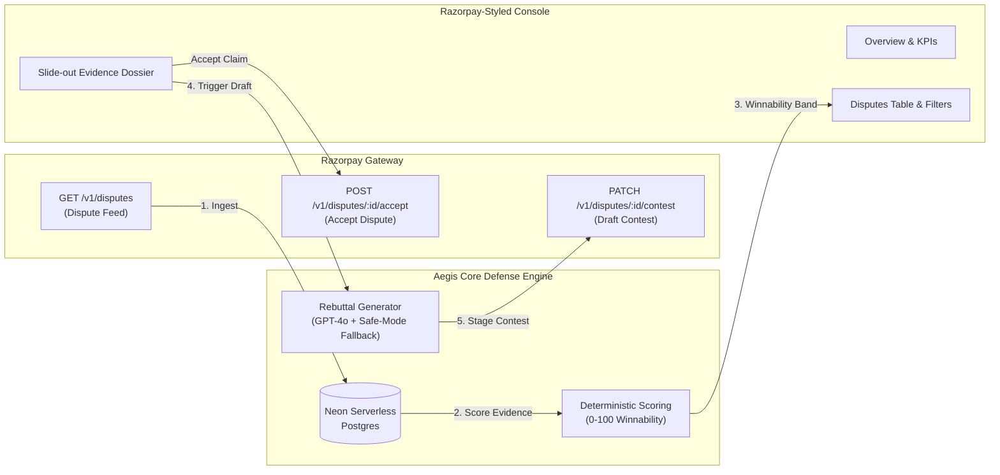

# Aegis — Autonomous Chargeback & Dispute Defense for Razorpay

> **Aegis** is an autonomous chargeback defense and dispute win engine built natively for the Indian payment rails and integrated directly with Razorpay's Contest Dispute APIs.

🌐 **Live Production App:** [https://aegisrazorpaycom.vercel.app](https://aegisrazorpaycom.vercel.app)  
🐘 **Database:** Neon Serverless PostgreSQL (`us-east-2`)  
⚡ **Deployment:** Vercel Production Serverless  

---

> [!NOTE]
> **Hackathon Prototype Note:** This project is an independent prototype built for the Razorpay Hackathon and is not an official Razorpay product.

---

## 1. The Problem & The UPI-First Wedge

### The Problem
Indian digital merchants face an increasingly aggressive dispute environment:
1. **Strict 3-Day SLA Window:** NPCI and card acquiring banks enforce a non-negotiable 3-calendar-day window to contest chargebacks before funds are permanently debited from the merchant settlement.
2. **High Manual Friction:** Finding proof of delivery (POD), courier AWB numbers, customer communication logs, GST tax invoices, and refund status logs across disconnected portals takes **45 to 60 minutes per dispute**.
3. **Abysmal Manual Win Rate:** Due to missed deadlines and poorly structured rebuttal letters, merchants win fewer than **12% of manual chargeback representments**, forfeiting millions in legitimate transaction revenue.

### The UPI-First Wedge
Global automated chargeback tools (Chargeflow, Signifyd, Riskified) are built exclusively for US/EU Visa and Mastercard credit cards. **None of them support NPCI's Unified Payments Interface (UPI)**, which accounts for over **80% of digital payment volume in India**.

Aegis is the first automated defense engine with deep native support for NPCI UPI reason codes alongside traditional card rails:
- **UPI 1064:** Goods / Services Not Received (AWB, OTP/signature verification)
- **UPI 108:** Beneficiary Account Not Credited (Settlement UTR & gateway capture logs)
- **UPI 1084:** Duplicate Processing / Multiple Debits (Distinct order & invoice indexing)
- **UPI 1061:** Credit / Refund Not Processed (Refund ARN & banking UTR tracking)
- **Card 4837:** No Cardholder Authorization (3D Secure OTP & IP telemetry)
- **Card 1062:** Goods Not as Described / Defective (Return policy & support resolution)

---

## 2. How Aegis Works



### 1. Ingestion & Multi-Source Reconciliation
Aegis polls the real Razorpay Disputes API (`GET /v1/disputes`) via the official Razorpay Node SDK. Live test-mode dispute events are merged with structured order, delivery, customer history, and refund records stored in Neon PostgreSQL.

### 2. Deterministic Winnability Scoring Engine
Unlike opaque LLM judges, Aegis calculates a mathematically transparent winnability score (0–100%) based on NPCI and card network rules:
- **High Winnability (≥80%):** Strong evidence present (signed POD, matching OTP, GST invoice). Recommendation: `Auto-Contest`.
- **Needs Evidence (50–79%):** Core evidence present but missing secondary logs (e.g. customer communication, specific return receipt). Recommendation: `Gather Evidence`.
- **Low Winnability (<50%):** Missing mandatory proof or merchant error (e.g. missing refund ARN on duplicate charge). Recommendation: `Accept Dispute` to avoid arbitration penalties.

### 3. Dual-Engine Rebuttal Generation (Zero-Failure Architecture)
- **Primary LLM Generator:** Drafts formal representment letters adhering to acquiring bank guidelines. Strictly grounds all claims in verified evidence documents with **zero hallucination**.
- **Deterministic Safe-Mode Fallback:** If the LLM times out (15s hard abort), hits rate limits, or credentials are unset, Aegis immediately falls back to a deterministic template engine built directly from the reason code and attached evidence IDs.

### 4. Direct Razorpay Staging Loop
Rebuttals and cited evidence URLs are submitted directly to Razorpay's Dispute Contest API (`PATCH /v1/disputes/:id/contest`) with `action: "draft"`, allowing dispute managers to review before final submission.

---

## 3. Seeded Dispute Cases & Winnability Curve

Aegis includes 6 realistic dispute cases covering the complete winnability spectrum:

| Dispute ID | Network | Reason Code | Title | Amount | Score | Band | Recommendation |
| :--- | :--- | :--- | :--- | :--- | :--- | :--- | :--- |
| `disp_1064` | **UPI** | `1064` | Goods Not Received | ₹24,999 | **94%** | `High` | **Contest** (Signed BlueDart POD + OTP + GST Invoice) |
| `disp_108` | **UPI** | `108` | Beneficiary Not Credited | ₹8,500 | **82%** | `High` | **Contest** (Razorpay Settlement UTR + Capture Log) |
| `disp_4837` | **Card** | `4837` | No Cardholder Auth | ₹14,500 | **68%** | `Needs Evidence` | **Gather Evidence** (3DS OTP present, missing device IP) |
| `disp_1084` | **UPI** | `1084` | Duplicate Processing | ₹2,999 | **62%** | `Needs Evidence` | **Gather Evidence** (Primary invoice present, explanation letter pending) |
| `disp_1062` | **Card** | `1062` | Goods Not as Described | ₹6,500 | **45%** | `Low` | **Accept** (Buyer escalated prior to merchant RMA return) |
| `disp_1061` | **UPI** | `1061` | Credit Not Processed | ₹4,200 | **23%** | `Low` | **Accept** (Refund was promised but banking UTR never initiated) |

---

## 4. Tech Stack & Architecture

- **Framework:** [Next.js 16 (App Router)](https://nextjs.org/) with React 19 and Turbopack
- **Database:** [Neon Serverless PostgreSQL](https://neon.tech/) with PgBouncer connection pooling
- **ORM:** [Prisma ORM 6](https://www.prisma.io/) (Serverless Singleton client)
- **Payment Gateway Integration:** Official [Razorpay Node SDK](https://github.com/razorpay/razorpay-node)
- **AI & Drafting:** OpenAI API (`gpt-4o-mini`) + Deterministic Rule-Based Safe Fallback
- **Styling & Design System:** Vanilla CSS & Tailwind CSS adhering to Razorpay Core Design Tokens (`#0C2340`, `#0C2340`, `#525866`)
- **Testing:** [Vitest](https://vitest.dev/) (26 unit/integration tests) & [Playwright](https://playwright.dev/) (E2E browser automation)

---

## 5. Local Setup & Getting Started

### Prerequisites
- Node.js 20+
- npm or pnpm
- A Neon PostgreSQL account or local PostgreSQL instance
- Razorpay Test-Mode API Keys (optional for mock fallback, recommended for live sync)

### 1. Clone the Repository
```bash
git clone https://github.com/YashDoesCode/aegis.razorpay.com.git
cd aegis.razorpay.com
```

### 2. Install Dependencies
```bash
npm install
```

### 3. Configure Environment Variables
Copy `.env.example` to `.env`:
```bash
cp .env.example .env
```

Fill in the required variables:

| Variable | Description | Source |
| :--- | :--- | :--- |
| `DATABASE_URL` | Neon PostgreSQL pooled connection URI (for queries) | [Neon Console](https://console.neon.tech/) |
| `DIRECT_URL` | Neon PostgreSQL direct connection URI (for migrations) | [Neon Console](https://console.neon.tech/) |
| `RAZORPAY_KEY_ID` | Razorpay Test Key ID (`rzp_test_...`) | [Razorpay Dashboard](https://dashboard.razorpay.com/#/app/keys) |
| `RAZORPAY_KEY_SECRET` | Razorpay Test Key Secret | [Razorpay Dashboard](https://dashboard.razorpay.com/#/app/keys) |
| `OPENAI_API_KEY` | OpenAI API Key (optional — falls back to safe mode) | [OpenAI Platform](https://platform.openai.com/) |

### 4. Database Setup & Seeding
```bash
# Push schema and apply migrations
npx prisma migrate deploy

# Seed the 6 dispute cases and evidence relationships
npm run db:seed
```

### 5. Start the Development Server
```bash
npm run dev
```
Open [http://localhost:3000](http://localhost:3000) in your browser.

---

## 6. Running Tests & Production Verification

```bash
# Run unit & integration test suite (26 tests)
npm test

# Run build verification
npm run build

# Run full live production QA against deployed URL
python3 test_production_qa.py
```

---

## 7. API Reference

| Method | Endpoint | Description |
| :--- | :--- | :--- |
| `GET` | `/api/health` | Service health status and timestamp |
| `GET` | `/api/disputes` | List all disputes with winnability scores & KPI stats |
| `GET` | `/api/disputes/:id` | Fetch dispute dossier, evidence checklist, and reason code rules |
| `POST` | `/api/disputes/:id/draft` | Generate evidence-grounded rebuttal and stage contest on Razorpay |
| `POST` | `/api/disputes/:id/accept` | Idempotently accept dispute and notify Razorpay API |
| `POST` | `/api/disputes/sync` | Perform live synchronization with Razorpay Disputes API |

---

## 8. License

Licensed under the [MIT License](LICENSE).
