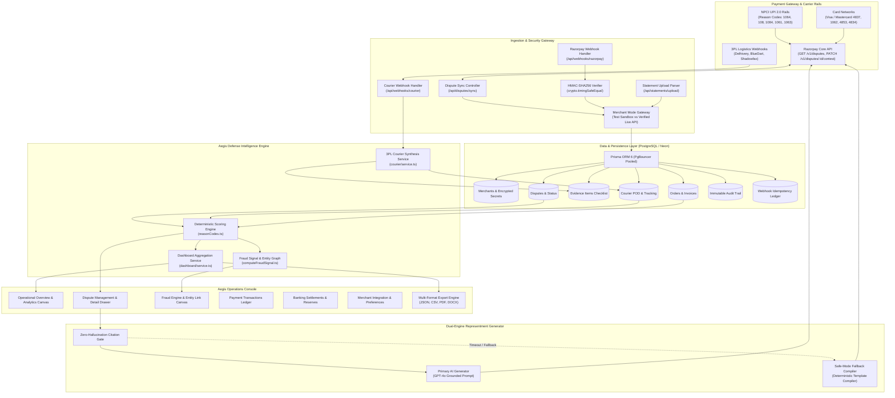
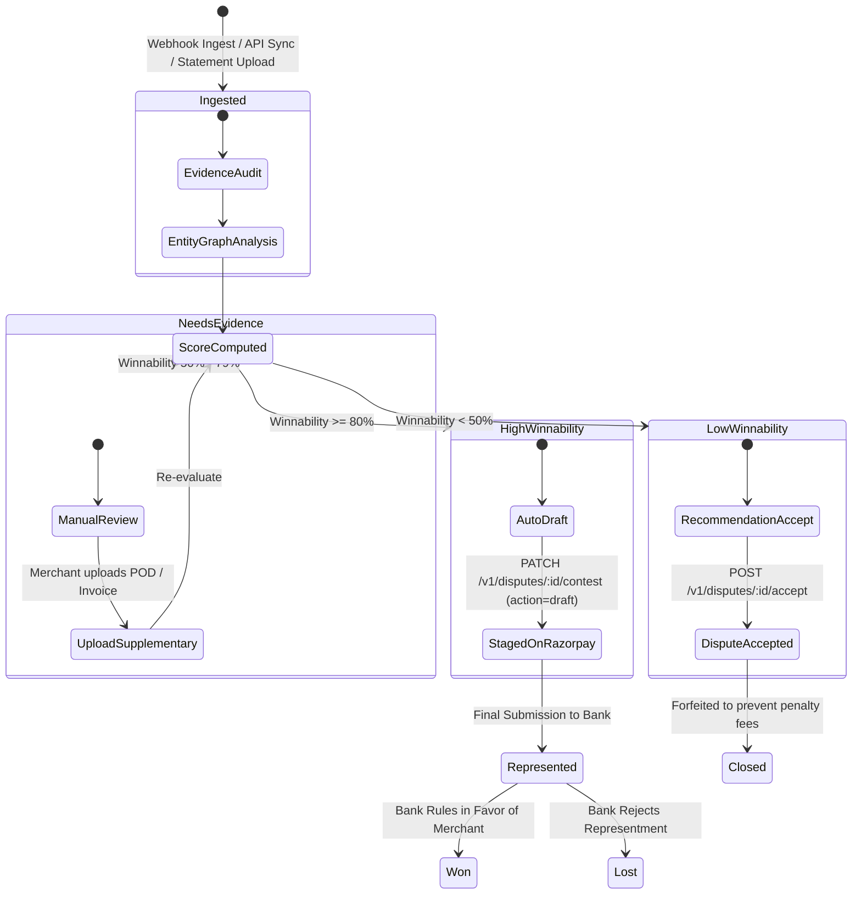

# Razorpay Aegis — Autonomous Chargeback & Dispute Defense Console

<p align="center">
  <a href="https://razorpay.com" target="_blank" rel="noopener noreferrer">
    
  </a>
</p>

<p align="center">
  <strong>Production-oriented dispute operations and defense console for merchants on Indian payment rails, featuring deterministic winnability scoring, first-party fraud intelligence, multi-carrier evidence orchestration, automated rebuttal drafting, custom statement ingestion, multi-format exports, and real-time Razorpay API synchronization.</strong>
</p>

<p align="center">
  <a href="https://aegisrazorpaycom.vercel.app">Production Deployment</a> &bull;
  <a href="https://razorpay.com/docs/payments/disputes/">Razorpay Dispute Docs</a> &bull;
  <a href="https://npci.org.in">NPCI UPI Guidelines</a> &bull;
  <a href="#system-architecture">Architecture</a> &bull;
  <a href="#api-reference">API Reference</a> &bull;
  <a href="#testing--verification">Test Verification</a>
</p>

---

## Notice

> **Hackathon Prototype Notice:** Aegis is an independent technical prototype developed for the Razorpay Hackathon. It is engineered to interface directly with Razorpay Dispute APIs, test-mode acquiring sandboxes, and connected merchant production accounts.

---

## Table of Contents

1. [Executive Summary & Problem Statement](#executive-summary--problem-statement)
2. [Ideation & Core Insights](#ideation--core-insights)
3. [Core Capabilities](#core-capabilities)
4. [System Architecture](#system-architecture)
5. [Dispute Lifecycle & State Machine](#dispute-lifecycle--state-machine)
6. [Aegis Engines](#aegis-engines)
   - [Deterministic Winnability Scoring Engine](#deterministic-winnability-scoring-engine)
   - [First-Party Fraud Intelligence & Entity Graph](#first-party-fraud-intelligence--entity-graph)
   - [Evidence Engine & 3PL Courier Integration](#evidence-engine--3pl-courier-integration)
   - [Dual-Engine Rebuttal Generation & Safe-Mode Fallback](#dual-engine-rebuttal-generation--safe-mode-fallback)
   - [Platform-Wide Immutable Audit Ledger](#platform-wide-immutable-audit-ledger)
7. [Demo / Test vs Live Merchant Modes](#demo--test-vs-live-merchant-modes)
8. [Dashboard & Operational Analytics](#dashboard--operational-analytics)
9. [Evidence & Statement Ingestion](#evidence--statement-ingestion)
10. [Export System](#export-system)
11. [Supported Network Reason Codes](#supported-network-reason-codes)
12. [API Reference](#api-reference)
13. [Security & Cryptography](#security--cryptography)
14. [Design System, Themes & UX](#design-system-themes--ux)
15. [Progressive Web App (PWA)](#progressive-web-app-pwa)
16. [Technology Stack](#technology-stack)
17. [Project Structure](#project-structure)
18. [Getting Started](#getting-started)
19. [Environment Variables](#environment-variables)
20. [Database Architecture & Migrations](#database-architecture--migrations)
21. [Testing & Verification](#testing--verification)
22. [Deployment](#deployment)
23. [Current Status & Roadmap](#current-status--roadmap)
24. [License](#license)

---

## Executive Summary & Problem Statement

Digital commerce in India operates on rails distinct from Western credit-card ecosystems. Over 80% of retail payment volume executes over the Unified Payments Interface (UPI 2.0) operated by NPCI, with the balance distributed across RuPay, Visa, Mastercard, and net banking gateways.

When a customer initiates a chargeback or dispute on Razorpay, merchants face severe structural operational challenges:

1. **Strict 72-Hour Response SLA:** Acquiring banks and NPCI enforce a non-negotiable 3-calendar-day window to contest disputes. Missed deadlines result in automatic permanent debits from merchant settlement accounts alongside non-refundable processing fees.
2. **Extreme Evidence Fragmentation:** Constructing a legally defensible representment packet requires aggregating data across disparate silos: courier Proof of Delivery (POD) from 3PL logistics, GST tax invoices from ERPs, customer support conversations from CRMs, and payment/refund Unique Transaction References (UTRs) from banking ledgers.
3. **Manual Representment Overhead:** Merging these records manually requires 45 to 60 minutes per dispute. Due to missing evidence, improper citations, or formatting errors, merchants forfeit legitimate revenue with an average manual win rate below 12%.
4. **Foreign Tool Incompatibility:** Legacy chargeback platforms (e.g. Chargeflow, Signifyd) are built exclusively for Western card schemes. They lack support for NPCI UPI reason codes, Indian GST invoice rules, or domestic 3PL courier tracking integrations (Delhivery, BlueDart, Shadowfax).

Aegis solves these challenges through an autonomous defense platform that reconciles payment telemetry, scores dispute winnability using deterministic bank rules, detects first-party friendly fraud via entity link analysis, and drafts evidence-grounded rebuttal dossiers staged directly onto Razorpay's Contest Dispute APIs.

---

## Ideation & Core Insights

```
+-----------------------------------------------------------------------------------+
|                            GATEWAY LEVEL DEFICIT                                  |
|                                                                                   |
|  1. Passive Dispute Pipeline:                                                     |
|     Gateways ingest dispute webhooks and present a generic file-upload form.      |
|     No proactive assessment of whether a dispute is winnable or unwinnable.       |
|                                                                                   |
|  2. Absence of Pre-Contest Evidence Auditing:                                     |
|     Merchants submit incomplete documents, triggering immediate bank rejection    |
|     and non-refundable arbitration fees.                                          |
|                                                                                   |
|  3. First-Party / Friendly Fraud Blind Spot:                                      |
|     Transactions are evaluated in isolation without historical graph analysis     |
|     linking customer email, phone, shipping addresses, and prior dispute ratios.  |
|                                                                                   |
|  4. Disconnected Settlement Intelligence:                                         |
|     Dispute reserves are held against merchant settlements without automated      |
|     triage advising whether to accept immediately (mitigating fees) or contest.   |
+-----------------------------------------------------------------------------------+
```

### Key Engineering Insights

- **Insight 1: Deterministic Rules Must Precede AI Drafting.** Generating legal representment letters with large language models without prior evidence validation leads to hallucinated claims. The scoring engine is 100% deterministic and rule-bound before any generative layer is invoked.
- **Insight 2: Safe Mode Fallback is Critical for Financial Systems.** If LLM APIs experience rate limits, outages, or missing keys, representment cannot be delayed. Aegis implements a zero-dependency deterministic template compiler that compiles compliant rebuttal packets instantly.
- **Insight 3: Strict Draft Staging Prevents Unintended Filings.** All automated contest operations are staged with `action: "draft"` via the Razorpay Contest API, ensuring merchant oversight while maintaining strict compliance with payment scheme rules.

---

## Core Capabilities

| Capability | Technical Description | Operational Benefit |
| :--- | :--- | :--- |
| **Deterministic Winnability Scoring** | Rule-based 0–100% scoring across 9 UPI & Card reason codes with explicit weighted checks | Eliminates guesswork; triages disputes into actionable priority bands |
| **First-Party Fraud Intelligence** | Multi-factor risk calculation analyzing repeat disputer ratios, identity mismatch, and delivery validation | Detects friendly fraud with automated defense strategy recommendations |
| **Interactive Entity Graph** | Interactive SVG relationship graph connecting Customer, Order, Payment, Dispute, Delivery, and Refund nodes | Visualizes transaction linkages and cross-entity risk signals |
| **3PL Courier POD Ingestion** | Extensible courier adapter architecture (Delhivery, BlueDart) parsing webhook scans and digital POD signatures | Sub-second delivery proof verification uplifting winnability scores |
| **Dual-Engine Rebuttal Generation** | Grounded GPT-4o drafting with strict evidence-citation guardrails + deterministic template fallback compiler | Zero-hallucination rebuttal letters generated in < 2 seconds |
| **Custom Statement Ingestion** | Multipart parser for CSV, XLSX, PDF, DOCX, TXT, and JSON files up to 10MB | Ingests external bank/gateway statements and reconciles exposure |
| **Canonical Multi-Format Export** | Backend export engine supporting JSON, CSV (UTF-8 BOM), branded PDF, and structured DOCX | One-click reporting for audits, banking representments, and finance |
| **Immutable Financial Audit Ledger** | Append-only audit trail logging all lifecycle transitions, API calls, and webhooks with distributed request tracing | Complete regulatory and forensic transparency |
| **AES-256-GCM Credential Isolation** | Envelope encryption (`v1:<iv>:<tag>:<ciphertext>`) for merchant API secrets with memory-only decryption | Zero plaintext secret storage in database or logs |
| **Restrained Enterprise Operations Console** | Information-dense layout featuring high-contrast AMOLED, neutral Dark, and clean Light themes | Calm, readable operations console with expandable contextual rail |

---

## System Architecture



---

## Dispute Lifecycle & State Machine



---

## Aegis Engines

### Deterministic Winnability Scoring Engine

Aegis evaluates dispute records against payment network rules to produce a transparent score from 0 to 100%.

$$\text{Score} = \min\left(100, \sum_{i=1}^{n} w_i \cdot \mathbb{I}(\text{evidence}_i \text{ is verified})\right)$$

Where $w_i$ is the rule weight and $\mathbb{I}(\cdot)$ indicates verified presence of the required document.

- **High Winnability ($\ge 80\%$):** Mandatory documents verified (e.g. Courier POD with digital signature/OTP, matching GST tax invoice). Action: `Contest Dispute`.
- **Needs Evidence ($50\% - 79\%$):** Primary transaction logs present, but secondary documentation missing (e.g. device IP telemetry, signed customer acknowledgement). Action: `Gather Evidence`.
- **Low Winnability ($< 50\%$):** Critical fulfillment or delivery proof missing, or confirmed merchant error (e.g. unissued refund on duplicate charge). Action: `Accept Dispute` to avoid compounding fees.

### First-Party Fraud Intelligence & Entity Graph

First-party ("friendly") fraud is analyzed across four behavioral dimensions:
1. **Repeat Disputer Ratio:** Historic disputes relative to completed orders ($\text{Disputes} / \text{Orders}$).
2. **Identity Verification:** Cross-correlation between customer name, billing address, shipping address, and phone number.
3. **Delivery Signature & OTP Validation:** Verification of physical proof of delivery containing verified OTP or receiver signature.
4. **Pre-Dispute Support Interactions:** Support communications acknowledging receipt or usage prior to dispute filing.

The engine generates an interactive SVG relationship graph linking Customer, Order, Payment, Dispute, Delivery, and Refund entities.

### Evidence Engine & 3PL Courier Integration

The courier subsystem (`src/lib/courier/`) ingests real-time 3PL tracking webhooks and normalizes carrier statuses (`DELIVERED`, `IN_TRANSIT`, `OUT_FOR_DELIVERY`, `FAILED_DELIVERY`, `RETURNED`) into canonical delivery records:
- **Supported Providers:** Built-in `DelhiveryAdapter` with constant-time HMAC signature verification and `MockCourierAdapter` for test environments.
- **Automated Evidence Attachment:** Delivery events automatically synthesize `shipping_proof` evidence items with POD links and digital signature markers, immediately boosting winnability scores.

### Dual-Engine Rebuttal Generation & Safe-Mode Fallback

1. **Primary AI Generator:** Uses `@ai-sdk/openai` with GPT-4o to construct a formal, grounded rebuttal letter citing verified documents.
2. **Citation Safety Gate:** Enforces that cited evidence must be a strict subset of verified present files, preventing AI hallucinations.
3. **Safe-Mode Fallback Compiler:** In case of API timeouts, missing keys, or rate limits, generates a deterministic legal representment letter using strict banking templates.

### Platform-Wide Immutable Audit Ledger

The `AuditService` (`src/lib/audit/`) provides an append-only, cryptographic audit trail:
- Every state mutation records event type, actor type, trigger source, correlation ID, and request ID.
- Automatically redacts sensitive credentials and payment secrets before write persistence.
- Uses dual storage: writes to PostgreSQL `audit_events` with in-memory circular fallback.

---

## Demo / Test vs Live Merchant Modes

Aegis enforces strict separation between demonstration and production environments:

```
+-----------------------------------+-----------------------------------+
| Demo / Test Sandbox               | Live Merchant Account             |
+-----------------------------------+-----------------------------------+
| • 6 deterministic seeded disputes | • Connected Razorpay merchant     |
| • Full synthetic order histories  | • Real dispute catalog via API    |
| • Simulated 3PL courier PODs      | • Staged contest drafting on live |
| • Zero external API credentials   | • AES-256-GCM encrypted secrets   |
| • Safe for evaluation and QA      | • Isolated live data store        |
+-----------------------------------+-----------------------------------+
```

The header contains a quiet enterprise environment dropdown (`Demo ▾` / `Live`) allowing instantaneous switching without page reloads.

---

## Dashboard & Operational Analytics

Backed by the centralized aggregation service (`src/lib/dashboard/service.ts`), the dashboard provides:

- **Executive KPIs:** Total Exposure (INR), Recovered Amount, Open Queue, High-Risk Count, Win Rate %, Evidence Gaps.
- **Interactive Exposure & Recovery Canvas:** Dynamic SVG chart with time ranges (`7D`, `30D`, `90D`, `6M`, `1Y`, `All`), pointer/touch crosshair tracking, click-to-lock tooltips, and progressive animation respecting `prefers-reduced-motion`.
- **Right Contextual Rail:** Scannable 4-section information rail (Attention, Recovery, Risk, Recent Activity) with one-click collapse.
- **Tabular Analytics:** Clean Reason Code distribution table and chronological audit timeline without visual badge clutter.

---

## Evidence & Statement Ingestion

Merchants can upload external gateway, settlement, or banking statements via `POST /api/statements/upload`:

- **Supported Formats:** `.csv`, `.xlsx`, `.pdf`, `.docx`, `.txt`, `.json` (up to 10MB).
- **Processing Pipeline:**
  $$\text{Upload} \longrightarrow \text{File Validation} \longrightarrow \text{Format Parsing} \longrightarrow \text{Record Normalization} \longrightarrow \text{Order Synthesis} \longrightarrow \text{Dispute Re-Scoring}$$
- **Duplicate Prevention:** SHA-256 content hashing prevents re-ingestion of duplicate statements.

---

## Export System

Canonical reports are generated directly from backend data models via `POST /api/export`:

| Format | Content Characteristics | Primary Use Case |
| :--- | :--- | :--- |
| **JSON** | Canonical structured JSON with metadata and ISO timestamps | Machine-readable ingestion & ERP ETL pipelines |
| **CSV** | RFC-4180 escaped CSV with UTF-8 Byte Order Mark (BOM) | Excel and spreadsheet financial reconciliation |
| **PDF** | Printable HTML document with Razorpay Aegis branding | Formal executive briefings and bank representments |
| **DOCX** | Structured Word document containing dispute and evidence tables | Legal team review and custom filing edits |

---

## Supported Network Reason Codes

| Code | Network | Description | Required Evidence | Target Winnability | Recommended Strategy |
| :--- | :--- | :--- | :--- | :--- | :--- |
| **1064** | UPI | Goods / Services Not Received | Signed POD, OTP, GST Invoice, Terms | **94% (High)** | Contest with Delivery & POD Logs |
| **108** | UPI | Debited, Beneficiary Not Credited | Settlement UTR, Capture Log | **82% (High)** | Contest with Bank Capture Telemetry |
| **4837** | Card | No Cardholder Authorisation | 3DS OTP Auth, IP Geo-log, Invoice | **68% (Needs Evidence)** | Gather Device IP & Access Logs |
| **1084** | UPI | Duplicate Processing / Multiple Debits | Distinct Invoices, Session Telemetry | **62% (Needs Evidence)** | Upload Invoices or Accept if Duplicate |
| **4853** | Card | Defective / Cancelled Merchandise | Return Policy, Support Logs, RMA | **58% (Needs Evidence)** | Provide RMA & Return Inspection Logs |
| **4834** | Card | Paid by Other Means | Alternative Payment Receipt, Ledger | **50% (Needs Evidence)** | Verify Alternative Payment Settlement |
| **1062** | Card | Goods Not As Described / Defective | SKU Catalog Match, Return Policy | **45% (Low)** | Accept unless Pre-Dispute RMA Resolved |
| **1063** | UPI | Cancelled / Returned Goods Not Refunded | Refund ARN / UTR Proof | **35% (Low)** | Provide Refund ARN or Accept |
| **1061** | UPI | Credit / Refund Not Processed | Banking Refund ARN, Payout UTR | **23% (Low)** | Accept (Refund was not initiated) |

---

## API Reference

### Health & Diagnostics
```http
GET /api/health
```

### Dispute Management
```http
GET    /api/disputes?mode=test|live
GET    /api/disputes/:id
POST   /api/disputes/:id/draft
POST   /api/disputes/:id/submit
POST   /api/disputes/:id/accept
POST   /api/disputes/sync?mode=test|live
```

### Statement Ingestion & Exports
```http
POST   /api/statements/upload   (multipart/form-data)
POST   /api/export              (json body: { type, format, mode })
```

### Merchant Integration
```http
GET    /api/merchant/status
POST   /api/merchant/connect
POST   /api/merchant/disconnect
```

### Webhook Endpoints
```http
POST   /api/webhooks/razorpay   (HMAC header: x-razorpay-signature)
POST   /api/webhooks/courier    (HMAC header: x-courier-signature)
```

---

## Security & Cryptography

- **AES-256-GCM Envelope Encryption:** Merchant API secrets are encrypted server-side using versioned envelopes (`v1:<iv>:<tag>:<ciphertext>`). Decryption occurs exclusively in ephemeral memory before SDK dispatch.
- **HMAC-SHA256 Webhook Verification:** Uses `crypto.timingSafeEqual` to guard against timing attacks on webhook signature checks.
- **Zero Secret Exposure:** Secret keys are masked in API responses (`rzp_live_...1234`), sanitized in structured logs, and excluded from client bundles.
- **Payload Deduplication:** SHA-256 hashing on webhook and upload payloads ensures idempotent processing without side-effects.

---

## Design System, Themes & UX

Aegis is styled as a mature fintech operations console:

- **Themes:**
  - **Dark (Default):** Neutral dark grey (`#121212` root, `#181818` card surfaces, `#2E2E2E` borders) with zero blue tint.
  - **AMOLED:** Pure `#000000` true black background, `#0A0A0A` surface, and high-contrast `#FFFFFF` typography.
  - **Light:** Clean `#FFFFFF` workspace with `#F8FAFC` secondary rail and subtle `#E2E8F0` borders.
- **Accent Profiles:** **Monochrome** (default) and **Razorpay Blue** (`#305EFF`).
- **Startup Intro Video:** Plays `/Intro (B&W).mp4` on dark/AMOLED themes with a seamless black background, and `/Intro.mp4` on light themes with a seamless white background.
- **Local State:** Managed via `safeStorage` (Theme, Accent, Sidebar, Onboarding, Reduced Motion).

---

## Progressive Web App (PWA)

Aegis includes full Chromium PWA installation support:
- Web App Manifest configured at `/public/manifest.json`.
- Restrained, dismissible install banner with Chrome/Edge detection.
- Standalone display mode optimization for desktop and mobile form factors.

---

## Technology Stack

| Layer | Technologies | Version |
| :--- | :--- | :--- |
| **Framework** | Next.js (App Router, Turbopack) | `16.3.3` |
| **Frontend Core** | React / React DOM | `19.2.8` |
| **Language** | TypeScript (Strict Mode) | `5.x` |
| **Styling & Motion** | Tailwind CSS v4, Framer Motion, Radix UI, Sonner | `4.x`, `13.1.1` |
| **Database & ORM** | PostgreSQL, Prisma ORM (PgBouncer connection pooling) | `6.4.1` |
| **AI & LLM SDK** | Vercel AI SDK, OpenAI SDK | `7.0.79`, `7.5.0` |
| **Payments SDK** | Razorpay Node.js SDK | `2.9.8` |
| **Test Framework** | Vitest, Puppeteer Core | `4.1.11`, `25.9.0` |
| **Deployment** | Vercel Serverless Platform | — |

---

## Project Structure

```
.
├── prisma/
│   ├── schema.prisma              # PostgreSQL schema (Merchants, Disputes, Orders, Deliveries, Audit)
│   └── seed.ts                    # Deterministic seed data generator
├── public/
│   ├── Intro (B&W).mp4            # Dark/AMOLED startup video asset
│   ├── Intro.mp4                  # Light mode startup video asset
│   └── manifest.json              # PWA manifest configuration
├── scripts/
│   └── visual-qa.mjs              # Puppeteer multi-theme visual QA verification
├── src/
│   ├── app/
│   │   ├── api/                   # REST API routes (disputes, webhooks, export, upload, merchant)
│   │   ├── disputes/              # Dispute management console route
│   │   ├── fraud/                 # Dedicated fraud engine & entity graph route
│   │   ├── overview/              # Main operational dashboard route
│   │   ├── settings/              # Merchant credentials & theme configuration
│   │   ├── settlements/           # Banking settlements & dispute reserves
│   │   ├── transactions/          # Payment transaction ledger
│   │   ├── globals.css            # Tailwind v4 theme token definitions
│   │   └── layout.tsx             # Root layout & providers
│   ├── components/
│   │   ├── dashboard/             # Dashboard shell, header, contextual rail, metric cards, chart
│   │   ├── disputes/              # Dispute detail sheet, evidence checklist, fraud signal card
│   │   ├── onboarding/            # Interactive walkthrough modal
│   │   ├── pwa/                   # PWA install prompt banner
│   │   ├── startup/               # Startup sequence overlay & video player
│   │   └── ui/                    # Base UI primitives (buttons, dropdowns, tooltips, dialogs)
│   ├── context/                   # React context providers (MerchantMode, ThemeContext)
│   └── lib/
│       ├── audit/                 # Platform immutable audit ledger service
│       ├── courier/               # 3PL logistics provider adapters (Delhivery, Mock)
│       ├── crypto/                # AES-256-GCM envelope encryption
│       ├── dashboard/             # Aggregation service for analytics & KPI calculation
│       ├── disputes/              # Dispute submission and representment staging
│       ├── drafting/              # GPT-4o grounded rebuttal generator & fallback compiler
│       ├── export/                # Multi-format report generator (JSON, CSV, PDF, DOCX)
│       ├── fraudSignal/           # Fraud index calculator & entity relationship builder
│       ├── razorpay/              # Razorpay SDK client & API wrapper
│       ├── scoring/               # Deterministic winnability rules & reason codes
│       ├── storage/               # Safe storage manager with localStorage fallback
│       └── upload/                # Multi-format statement parser & normalizer
└── package.json
```

---

## Getting Started

### Prerequisites

- Node.js `20.x` or higher
- npm or pnpm
- PostgreSQL instance (Neon Serverless PostgreSQL recommended)

### 1. Clone & Install Dependencies

```bash
git clone https://github.com/YashDoesCode/aegis.razorpay.com.git
cd aegis.razorpay.com
npm install
```

### 2. Configure Environment

```bash
cp .env.example .env
```

### 3. Database Deployment & Seed

```bash
# Generate Prisma Client
npm run prisma:generate

# Deploy database migrations
npm run db:deploy

# Seed deterministic demo disputes and evidence
npm run db:seed
```

### 4. Run Development Server

```bash
npm run dev
```

Open [http://localhost:3000](http://localhost:3000) in your browser.

---

## Environment Variables

| Variable | Required | Description |
| :--- | :--- | :--- |
| `DATABASE_URL` | **Yes** | PostgreSQL connection string (PgBouncer pooled) |
| `DIRECT_URL` | **Yes** | Direct PostgreSQL connection string (unpooled, for migrations) |
| `AEGIS_ENCRYPTION_KEY` | **Yes (Prod)** | 32-byte hex or high-entropy master key for AES-256-GCM credential encryption |
| `RAZORPAY_KEY_ID` | Optional | Razorpay API Key ID (for live merchant synchronization) |
| `RAZORPAY_KEY_SECRET` | Optional | Razorpay API Key Secret |
| `RAZORPAY_WEBHOOK_SECRET`| Optional | HMAC webhook signing secret for Razorpay webhooks |
| `COURIER_WEBHOOK_SECRET` | Optional | HMAC webhook signing secret for 3PL logistics webhooks |
| `OPENAI_API_KEY` | Optional | OpenAI API Key for AI rebuttal drafting (falls back to safe mode if unset) |
| `NEXT_PUBLIC_APP_URL` | Optional | Base application URL for absolute callbacks and metadata |

---

## Database Architecture & Migrations

Aegis uses PostgreSQL with Prisma ORM:
- **`merchants`**: Linked Razorpay merchant accounts with AES-256-GCM encrypted credentials.
- **`customers`**: Customer profiles with order history and dispute frequency metrics.
- **`orders`**: Commercial orders linked to payments, deliveries, communications, and disputes.
- **`deliveries`**: 3PL tracking records with courier names, tracking IDs, and signature markers.
- **`communications`**: Pre-dispute customer support messages across email, WhatsApp, and chat.
- **`refunds`**: Processed and pending refunds with banking ARN references.
- **`disputes`**: Active disputes with network classification, amounts, phase, and SLA dates.
- **`evidence_items`**: Categorized evidence checklist items mapped to Razorpay dispute schema.
- **`webhook_events`**: Ingested webhook log with payload hash uniqueness for idempotency.
- **`audit_events`**: Immutable append-only audit trail with correlation IDs.

---

## Testing & Verification

Aegis enforces a comprehensive automated test suite:

```bash
# Run all unit and integration test suites
npm test

# Run Next.js production build verification
npm run build

# Run multi-theme browser visual QA
node scripts/visual-qa.mjs
```

### Verified Test Status

- **Unit & Integration Suite (`vitest`):** **27 test files passed, 166 / 166 tests passed (100% pass rate)**.
- **TypeScript (`tsc --noEmit`):** **0 errors**.
- **ESLint (`eslint`):** **0 errors, 0 warnings**.
- **Production Build (`next build`):** **Compiled successfully in Turbopack**.

---

## Deployment

Aegis is optimized for zero-configuration deployment on **Vercel**:

1. Connect the GitHub repository to Vercel.
2. Configure the required environment variables (`DATABASE_URL`, `DIRECT_URL`, `AEGIS_ENCRYPTION_KEY`, and optional `OPENAI_API_KEY`).
3. Set the build command to `npm run vercel-build`.
4. Deploy.

---

## Current Status & Roadmap

### Implemented & Verified in Production

- [x] Deterministic Winnability Engine across 9 UPI and Card reason codes.
- [x] First-Party Fraud Detection & Interactive Entity Link Graph.
- [x] Dual-Engine Rebuttal Generation with Citation Guardrails & Safe-Mode Fallback.
- [x] 3PL Logistics Adapter Engine (Delhivery webhook parsing & POD verification).
- [x] Platform-Wide Immutable Financial Audit Ledger with Distributed Tracing.
- [x] AES-256-GCM Envelope Encryption for Merchant Credentials.
- [x] Custom Statement Ingestion Engine (CSV, XLSX, PDF, DOCX, TXT, JSON).
- [x] Canonical Multi-Format Export Engine (JSON, CSV, PDF, DOCX).
- [x] Operations Console Dashboard with Exposure/Recovery Chart and Contextual Rail.
- [x] Multi-Theme Architecture (AMOLED, Dark, Light) with Monochrome & Razorpay Blue accents.
- [x] Theme-Aware Video Startup Experience & Chromium PWA Install Support.
- [x] 100% Automated Test Suite (166 / 166 tests passing).

### Planned Roadmap

- [ ] Automated OCR document extraction for physical receipt images.
- [ ] Direct webhooks and tracking adapters for additional 3PL logistics networks.
- [ ] Bi-directional WhatsApp interactive merchant notification alerts.
- [ ] Multi-merchant enterprise role-based access control (RBAC).

---

## License

Distributed under the [MIT License](LICENSE).
