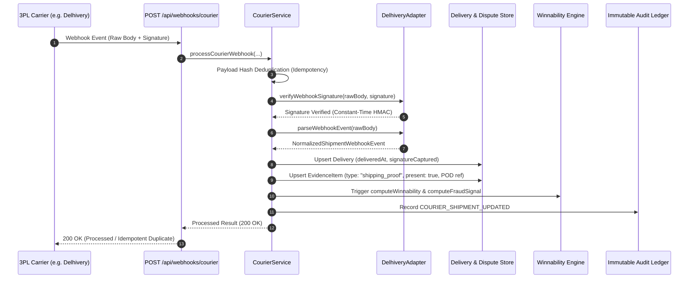

# 3PL Logistics & Courier Evidence Ingestion Architecture

## Overview

Razorpay Aegis implements a provider-agnostic 3PL / courier integration architecture engineered to ingest fulfillment telemetry, delivery milestones, Proof of Delivery (POD) documents, and recipient signatures across logistics networks in India.

This architecture directly solves the **"Goods Not Received" (UPI 1064 / Card 4837)** representment challenge by automatically transforming real-time carrier scans into legally grounded evidence items (`shipping_proof`) attached to contested disputes.

---

## 1. Provider-Agnostic Adapter Abstraction

The courier layer is designed around an extensible interface (`CourierAdapter`) decoupling carrier-specific API formats and webhook protocols from the Aegis dispute domain.

```typescript
export interface CourierAdapter {
  readonly providerId: string;
  readonly displayName: string;

  verifyWebhookSignature(
    rawBody: string,
    signature: string | null,
    secret: string
  ): boolean;

  parseWebhookEvent(
    rawBody: string,
    headers?: Record<string, string>
  ): Promise<NormalizedShipmentWebhookEvent>;

  fetchTracking(
    trackingId: string
  ): Promise<NormalizedShipment>;
}
```

### Supported Providers
- **`DelhiveryAdapter`**: Production adapter for Delhivery Waybill / AWB tracking, scan status normalization, and HMAC-SHA256 constant-time signature verification.
- **`MockCourierAdapter`**: Deterministic test fixture adapter for sandbox simulations, automated testing, and offline execution.

---

## 2. Canonical Shipment Lifecycle

Different logistics networks report varied status terminology (`DL`, `PU`, `OFD`, `UD`, `RT`, `Manifested`, `In Transit`). Aegis normalizes all carrier scans into a strict canonical lifecycle:

| Canonical Status | Meaning | Evidence & Dispute Defense Impact |
|:---|:---|:---|
| `CREATED` | AWB created; package awaiting dispatch | Neutral (Fulfillment in progress) |
| `PICKED_UP` | Package collected from merchant warehouse | Proves order fulfillment initiated |
| `IN_TRANSIT` | Package moving across carrier hubs | Proves active transit |
| `OUT_FOR_DELIVERY` | Package out with delivery agent | Delivery imminent |
| `DELIVERED` | Package successfully handed over to recipient | **Primary Evidence**: Creates verified `shipping_proof`, attaches POD document reference, sets `signatureCaptured` flag. |
| `FAILED_DELIVERY` | Delivery attempt failed (customer unavailable) | Documents attempted fulfillment |
| `RETURNED` | Package returned to origin (RTO) | Evidence for concession or return processing |
| `CANCELLED` | Order cancelled before shipment completion | Order cancellation evidence |
| `LOST` | Package lost or damaged in carrier custody | Carrier liability claim record |
| `EXCEPTION` | Operational delay (customs, weather, bad address) | Timeline documentation |

---

## 3. End-to-End Ingestion Flow



---

## 4. Webhook Security & Idempotency

1. **Constant-Time Verification**:
   Signatures are verified using `crypto.timingSafeEqual` over HMAC-SHA256 digests to protect against timing attacks.
2. **Payload-Hash Idempotency**:
   Every webhook payload is hashed with SHA-256 (`computeCourierPayloadHash`). Replays or repeated carrier deliveries are safely recognized as duplicates (`status: "duplicate"`) without mutating dispute state or duplicate audit writes.
3. **Trace Context Propagation**:
   End-to-end `correlationId` (`corr_courier_...`) and `requestId` (`req_courier_...`) are tracked across controllers, adapter parsing, evidence attachment, and structured logging.

---

## 5. Scoring & Rebuttal Engine Integration

### Winnability Scoring Impact
When a courier webhook confirms delivery with recipient signature/OTP:
- **Rule `shipping_proof_present`**: Evaluates to `true` (+34 pts for UPI 1064).
- **Rule `tracking_matches_customer`**: Evaluates to `true` with destination address and signature (+25 pts).
- **Overall Winnability**: Increases dispute winnability into the **High Band** ($\ge 80\%$), transitioning the recommended action from `gather_evidence` to `contest`.

### Rebuttal Prose Grounding
The rebuttal drafting engine incorporates structured courier telemetry:
- Carrier name (e.g., Delhivery, BlueDart)
- Waybill / AWB tracking reference
- Precise delivery timestamp
- Recipient address match confirmation
- Digital OTP / recipient signature verification

Raw carrier payloads are strictly sanitized before prompting LLMs, ensuring zero unvetted instruction injection.

---

## 6. Live vs Test Mode Isolation

- **Test / Sandbox Mode**: Operates using seeded mock dispute references and deterministic mock courier adapters (`MockCourierAdapter`).
- **Live Mode**: Ingests real 3PL carrier webhooks and queries production carrier APIs.
- **Zero Exposure Guarantee**: Carrier secrets, webhook tokens, and internal database keys are never exposed in API responses or logs.
