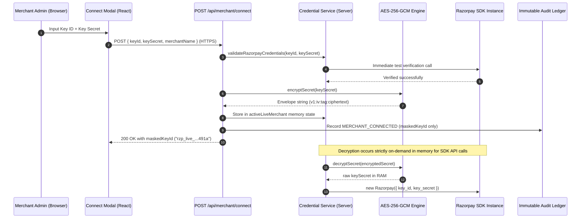

# Merchant Razorpay API Secret Encryption Architecture

## Overview

Razorpay Aegis implements server-side authenticated envelope encryption for merchant Razorpay API secrets using **AES-256-GCM** (Galois/Counter Mode).

This architecture guarantees:
1. Merchant API secrets are never stored or transmitted in plaintext.
2. Authenticated encryption ensures confidentiality and detects any tampering with ciphertext, initialization vectors (IVs), or authentication tags.
3. Decryption is strictly scoped to the server runtime in ephemeral memory only when constructing authorized Razorpay SDK instances.
4. Browser clients never receive decrypted API secrets after credential submission.
5. All logging and audit ledger subsystems automatically redact or mask sensitive credential fields.

---

## Cryptographic Specification

| Parameter | Specification | Details |
|:---|:---|:---|
| **Cipher Algorithm** | `aes-256-gcm` | NIST SP 800-38D compliant Authenticated Encryption with Associated Data (AEAD) |
| **Key Size** | 256 bits (32 bytes) | Derived from `AEGIS_ENCRYPTION_KEY` or `AEGIS_MASTER_KEY` via SHA-256 or 64-char hex |
| **IV / Nonce Size** | 96 bits (12 bytes) | Generated uniquely per encryption operation via `crypto.randomBytes(12)` |
| **Auth Tag Size** | 128 bits (16 bytes) | Integrity and authenticity verification tag generated by GCM cipher |
| **Envelope Format** | `v1:<iv_hex>:<tag_hex>:<ciphertext_hex>` | Versioned, unambiguous, colon-delimited hexadecimal string representation |

---

## Ciphertext Storage Envelope

The encrypted payload string adheres to the following layout:

```
+-----------+---+------------------------+---+----------------------------------+---+--------------------+
|  version  | : |   iv_hex (24 chars)    | : |        tag_hex (32 chars)        | : |   ciphertext_hex   |
+-----------+---+------------------------+---+----------------------------------+---+--------------------+
|   "v1"    | : | 12 bytes / 96-bit hex  | : |      16 bytes / 128-bit hex      | : | Variable length    |
+-----------+---+------------------------+---+----------------------------------+---+--------------------+
```

### Invariants:
- **Uniqueness**: Encrypting the exact same API secret multiple times produces distinct ciphertexts because a fresh, cryptographically secure 12-byte IV is generated on each encryption call.
- **Tamper Evidence**: Any modification to the ciphertext, the IV, or the authentication tag causes AES-GCM decryption to fail closed with an authentication tag verification error.
- **Key Rotation Ready**: The `v1` prefix allows seamless introduction of new encryption versions (e.g. `v2`) or envelope formats without corrupting existing records.

---

## Key Management & Environment Configuration

### Environment Variables
- `AEGIS_ENCRYPTION_KEY`: Primary master encryption key variable.
- `AEGIS_MASTER_KEY`: Supported fallback alias.
- `ENCRYPTION_KEY`: Secondary fallback alias.

### Validation & Fail-Closed Behavior
- `validateEncryptionConfig()` executes validation checks:
  - In **Production** (`NODE_ENV === "production"`): A valid master key must be configured in environment variables and meet entropy requirements. If missing or shorter than 16 characters, the service fails closed and throws an explicit initialization error.
  - In **Development / Test**: Uses a deterministic dev key when no environment variable is provided, ensuring local test suites run reliably.

---

## End-to-End Credential Flow



---

## Zero-Exposure & Defense-in-Depth Measures

1. **No Plaintext Secret in Browser**:
   - `GET /api/merchant/status` returns `maskedKeyId` only (e.g., `rzp_live_1...cdef`).
   - Neither the plaintext secret nor the encrypted secret is returned in any JSON response payload.
2. **No Plaintext Secret in Logs**:
   - `logger.ts` includes an automated context sanitizer that redacts any object property containing `secret`, `key`, `password`, `token`, `authorization`, `signature`, `bearer`, or `cookie`.
3. **No Plaintext Secret in Audit Events**:
   - `AuditService` recursively sanitizes all event payloads, before/after states, and metadata dictionaries before dispatching to the database or in-memory ledger.
4. **Strict Live vs Test Isolation**:
   - Test mode operations use sandbox fixtures and environment placeholders.
   - Live credentials operate exclusively in `mode === "live"` workflows.
   - Disconnecting a merchant account clears memory references and resets status immediately.

---

## Verification & Test Matrix

Unit and integration tests are maintained under `src/lib/crypto/__tests__/encryption.test.ts` and `src/lib/__tests__/merchantEncryption.test.ts`:

- Encrypt / decrypt round trip validation.
- IV uniqueness across identical plaintexts.
- Ciphertext tampering rejection (fails closed).
- Auth tag tampering rejection (fails closed).
- IV tampering rejection (fails closed).
- Invalid master key rejection.
- Malformed and unsupported version handling.
- Production missing key fail-closed enforcement.
- Status API response secret omission.
- Memory isolation during live / test mode transitions.
- Logger and Audit ledger redaction verification.
