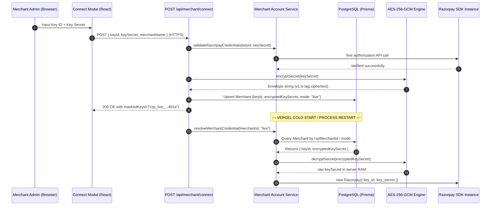

# Merchant Razorpay API Secret Encryption & Persistence Architecture

## Overview

Razorpay Aegis implements server-side authenticated envelope encryption for merchant Razorpay API secrets using **AES-256-GCM** (Galois/Counter Mode) combined with durable PostgreSQL storage via Prisma.

This architecture guarantees:
1. **Durable Cold-Start Recovery**: Encrypted credentials survive serverless Vercel cold-starts and process restarts.
2. **Zero Plaintext Storage**: Plaintext API secrets are never stored in databases, logs, response bodies, or client-side storage.
3. **Authenticated Encryption (AEAD)**: Ensures confidentiality and detects any tampering with ciphertext, initialization vectors (IVs), or authentication tags.
4. **Server-Only Decryption**: Decryption is strictly scoped to the server runtime in transient memory when constructing authorized Razorpay SDK instances.
5. **Multi-Tenant & Mode Isolation**: Test and live credentials are strictly partitioned by merchant identity and environment mode.
6. **Redaction & Sanitization**: All logging and audit ledger subsystems automatically redact sensitive credential fields.

---

## Cryptographic Specification

| Parameter | Specification | Details |
|:---|:---|:---|
| **Cipher Algorithm** | `aes-256-gcm` | NIST SP 800-38D compliant Authenticated Encryption with Associated Data (AEAD) |
| **Key Size** | 256 bits (32 bytes) | Derived from `AEGIS_ENCRYPTION_KEY` or `AEGIS_MASTER_KEY` via SHA-256 or 64-char hex |
| **IV / Nonce Size** | 96 bits (12 bytes) | Generated uniquely per encryption operation via `crypto.randomBytes(12)` |
| **Auth Tag Size** | 128 bits (16 bytes) | Integrity and authenticity verification tag generated by GCM cipher |
| **Envelope Format** | `v1:<iv_hex>:<tag_hex>:<ciphertext_hex>` | Versioned, unambiguous, colon-delimited hexadecimal string representation |
| **Durable Storage** | PostgreSQL (`merchants` table) | `keyId` (Public Key ID) + `encryptedKeySecret` (AES-256-GCM Envelope String) |

---

## Ciphertext Storage Envelope

The encrypted payload string adheres to the following layout:

```
+-----------+---+------------------------+---+----------------------------------+---+--------------------+
|  version  | : |   iv_hex (24 chars)    | : |        tag_hex (32 chars)        | : |   ciphertext_hex   |
+-----------+---+------------------------+---+----------------------------------+---+--------------------+
|   "v1"    | : | 12 bytes / 96-bit hex  | : |      16 bytes / 128-bit hex      | : | Variable length    |
+-----------+---+------------------------+---+----------------------------------+---+--------------------+
```

### Invariants:
- **Uniqueness**: Encrypting the exact same API secret multiple times produces distinct ciphertexts because a fresh, cryptographically secure 12-byte IV is generated on each encryption operation.
- **Tamper Evidence**: Any modification to the ciphertext, IV, or authentication tag causes AES-GCM decryption to fail closed with an authentication tag verification error.
- **Key Rotation Ready**: The `v1` prefix allows seamless introduction of new encryption versions (e.g. `v2`) or key envelope formats without corrupting existing database records.

---

## End-to-End Credential Flow & Cold-Start Recovery



---

## Zero-Exposure & Defense-in-Depth Measures

1. **Durable Persistence without Secret Leakage**:
   - `keyId` (public identifier) and `encryptedKeySecret` (AES-256-GCM envelope) are saved to PostgreSQL via Prisma.
   - `GET /api/merchant/status` returns `maskedKeyId` only (e.g. `rzp_live_1...cdef`).
   - Decrypted secrets exist strictly in transient server memory during request handling.
2. **No Plaintext Secret in Logs**:
   - `logger.ts` includes an automated context sanitizer redacting properties like `secret`, `keySecret`, `password`, `authorization`, `signature`, `bearer`, or `cookie`.
3. **No Plaintext Secret in Audit Events**:
   - `AuditService` recursively sanitizes all event payloads, before/after states, and metadata dictionaries before dispatching to database audit logs.
4. **Strict Live vs Test Isolation**:
   - Test mode operations use sandbox fixtures and environment placeholders.
   - Live credentials operate exclusively in `mode === "live"` workflows.
5. **Clean Disconnection & Scrubbing**:
   - Disconnecting a merchant nullifies `keyId` and `encryptedKeySecret` in the database and resets `mode` to `disconnected`.

---

## Verification & Test Matrix

Automated test suites under `src/lib/__tests__/merchantEncryption.test.ts` and `src/lib/crypto/__tests__/encryption.test.ts`:

- Encrypt / decrypt round-trip validation.
- Cold-start recovery from database after Node.js process memory reset.
- Credential rotation (overwriting old active credentials securely).
- Disconnect scrubbing (wiping key material from database).
- Ciphertext, IV, and tag tampering rejection (fail closed).
- Multi-tenant credential isolation.
- Logger and Audit ledger redaction verification.
