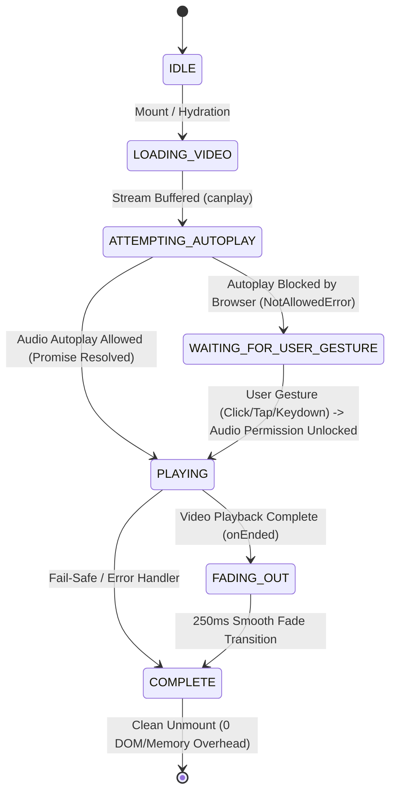

# Aegis Startup Architecture & Playback Flow

## Overview

Razorpay Aegis implements a deterministic, enterprise-grade startup sequence that boots the application on fresh launches and browser refreshes before rendering the active dashboard.

The startup sequence is engineered to provide the tactile feel of financial trading software and high-security operations consoles (e.g. Bloomberg Terminal, Stripe Dashboard initialization) while strictly adhering to modern browser autoplay, media permissions, and WCAG accessibility standards.

---

## Startup Sequence State Machine



---

## Cross-Browser Autoplay Policy & Recovery

Modern browsers enforce strict restrictions on autoplaying media with sound:

| Browser / Platform | Audible Autoplay Behavior | Aegis Handling & Recovery Strategy |
| :--- | :--- | :--- |
| **Google Chrome / Chromium** | Blocked unless user's Media Engagement Index (MEI) is high or prior domain interaction exists. | Attempts immediate playback with audio. If rejected with `NotAllowedError`, immediately displays the Enterprise Startup HUD (`"Click anywhere to start Aegis"`). First click/keypress unlocks audio and plays from start. |
| **Apple Safari (macOS & iOS)** | Strictly blocked without user gesture. iOS requires `playsinline` attribute. | `<video>` includes `playsInline`, `preload="auto"`, and `muted={false}`. Rejection switches to interactive prompt. User tap/touch unlocks media playback with audio. |
| **Mozilla Firefox** | Blocks audible autoplay by default. | Rejection cleanly transitions state machine to `WAITING_FOR_USER_GESTURE`. Spacebar, Enter, or Click resumes full audio playback. |
| **Microsoft Edge** | Follows Chromium MEI rules. | Full recovery parity with Chrome / Chromium. |

### Guarantees
- **Never Silently Muted**: Aegis never falls back to muted autoplay, preserving the sound-enabled boot experience.
- **Fail-Safe Unlocking**: A 12-second watchdog timer and error boundary ensure that if network failure or decoding errors occur, the dashboard is cleanly unlocked and never leaves the user stuck on a black screen.
- **Session Persistence**: Stored in React context memory. The intro plays on fresh tab launches and hard page reloads (`Cmd+R` / `F5`), but **never replays during client-side Next.js route navigation** (e.g., switching between `/overview`, `/disputes`, `/transactions`, `/settlements`, and `/settings`).

---

## Media Asset Streaming (/api/startup/video)

To load `src/assets/Intro.mp4` directly from the project repository without compression or modification, Aegis exposes an RFC 7233 compliant HTTP byte-range route handler at `/api/startup/video`:

- **HTTP 200 OK**: Emitted when full file is requested, with `Content-Type: video/mp4`, `Accept-Ranges: bytes`, `Content-Length`, and immutable caching headers.
- **HTTP 206 Partial Content**: Emitted when `Range: bytes=start-end` is supplied by Safari, iOS, or Chromium, enabling fast chunked buffering and non-blocking streaming.
- **HTTP HEAD**: Supports preflight range and content-length inspection without payload transmission.

---

## Component Structure

```
src/
├── app/
│   ├── api/
│   │   └── startup/
│   │       └── video/
│   │           └── route.ts          # RFC 7233 byte-range video streaming endpoint
│   └── layout.tsx                    # Root application shell with StartupProvider & StartupExperience
└── components/
    └── startup/
        ├── types.ts                  # State machine and context TypeScript types
        ├── startup-context.tsx       # Session-persistent startup context & provider
        ├── useStartupPlayback.ts     # Playback lifecycle, autoplay attempt & recovery hook
        ├── StartupVideo.tsx          # Hardware-accelerated HTML5 video renderer
        ├── StartupOverlay.tsx        # Terminal HUD / boot console UI & interaction surface
        ├── StartupExperience.tsx     # Main orchestrator component
        ├── index.ts                  # Barrel export
        └── __tests__/
            ├── videoRoute.test.ts
            └── startupStateMachine.test.ts
```
